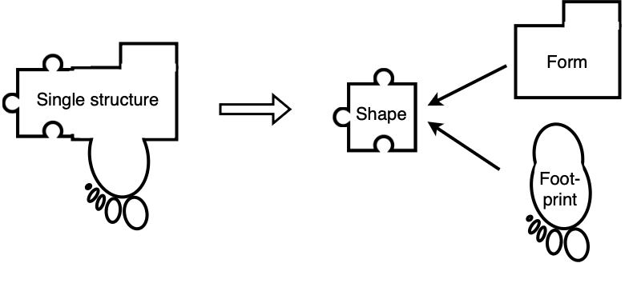

## High-Level Architecture
{:#architecture}

A common way how web applications store their data is by using only one fixed structure, not allowing to use the data with another application that uses a different structure.
This is even the case for many Solid apps that assume the data is stored in a fixed location in the pod with only one vocabulary.
 visualizes the in this paper proposed shift from a single structure where the application is built on top of this structure, towards a three-part view where the data is divided into three parts: a form (for display), shape (for validation), and footprint (for reasoning) part.

Yet, users interact with traditional centralized web applications using different interfaces that are all written for and work only with that single web server.
Additionally, the data is stored on the server of the application, outside the user's control.
The [Solid protocol](cite:cites solid-protocol) provides a standardized interface, but still many apps are being built with assumptions about the data stored in the pod, and the apps are designed for one specific use case.

<figure id="fig:eaen-currently-to-goal">

<figcaption markdown="block">
Transition from the traditional single structure where all the data is defined using a single vocabulary, to a three-part view, consisting of a form (for display), shape (for validation), and footprint (for reasoning) part.
</figcaption>
</figure>

This paper pushes this decentralized architecture a step further with the introduction of a declarative Solid app that makes no assumptions about the interface and app itself.
The previous problem of needing a separate app for each use case is solved by describing the user interface in a declarative way: the *form description resource*.
A schematic overview of the architecture is shown in .
The problem that the app still needs to understand the ontology of the form description is overcome with the use of *schema alignment tasks* translating it into one the app understands.
The *N3 conversion rules* in the third input are used by the renderer app to perform this mapping.
Data stored in the *data resource* can be used to prefill the form.
Next, reasoning is also used to apply *footprint tasks*: the execution of policies when a certain action occurs, such as submission.
A remote or local reasoner can be used to perform these tasks.
This declaratively generated app built by the renderer app can then be used to interact with one or more Solid pods.
This concept of having a display part that is unrelated to the viewing environment is discussed in .

<figure id="fig:eaen-stage-2">

<figcaption markdown="block">
Users interact with a dynamically generated app built by a form renderer using the 3 inputs displayed on the right.
This generic renderer app can build for multiple viewing environments without making assumptions about the interface and app itself.
It uses a reasoner to apply the schema alignment and footprint tasks.
The user can use the generated app to interact with one or more Solid pods.
</figcaption>
</figure>
