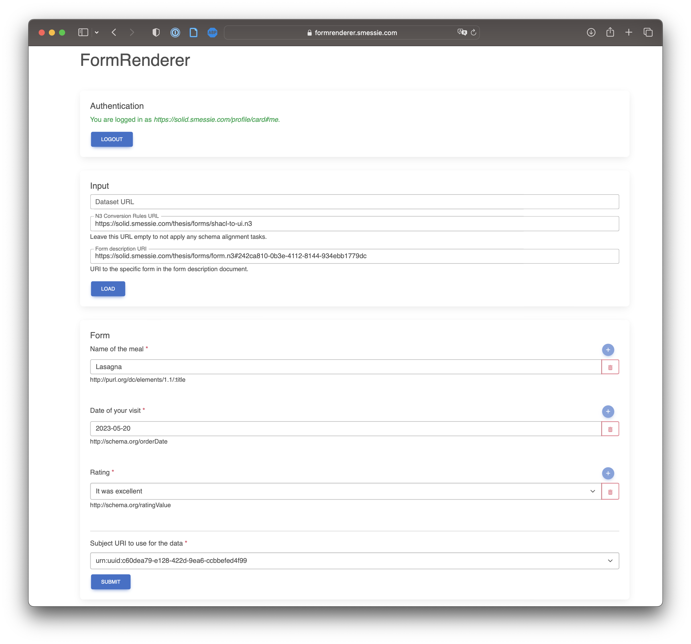

## Multiple Viewing Environments
{:#environments}

<figure id="fig:eaen-FormRenderer">

<figcaption markdown="block">
Screenshot of the implemented FormRenderer.
</figcaption>
</figure>

The display part is the part of the form description that is responsible for rendering the form to the user.
[SHACL](cite:cites shacl), [Solid-UI](cite:cites solid-ui), and [RDF-Form](cite:cites rdf-form) are already existing ontologies that can be used for this purpose.

By declaratively describing the form in RDF, it should be possible to render the form in any environment.
Web forms are typically HTML, while RDF represents the semantics of the form, not how you represent it in HTML.
To prove that the display part is unrelated to the viewing environment, two proof-of-concept applications are implemented that can render the same form description in multiple viewing environments.
The first app is the *FormRenderer* (see ) which renders the form description in a web browser using HTML.
The second app is the *FormCli* which renders the form description in a text-based command-line interface.
While the architecture and implementation of these apps are very similar to each other, the main difference is that the FormCli app does not have a GUI and uses a text-based terminal instead.

These implementations prove that the display part is unrelated to the viewing environment as the same form description can be rendered with the two apps.
Everything about how to render the form can be derived from the RDF form description, making it declarative.
By making form descriptions portable and not tight to one rendering environment or one rendering logic, machines can be controlled to create forms in multiple viewing environments.