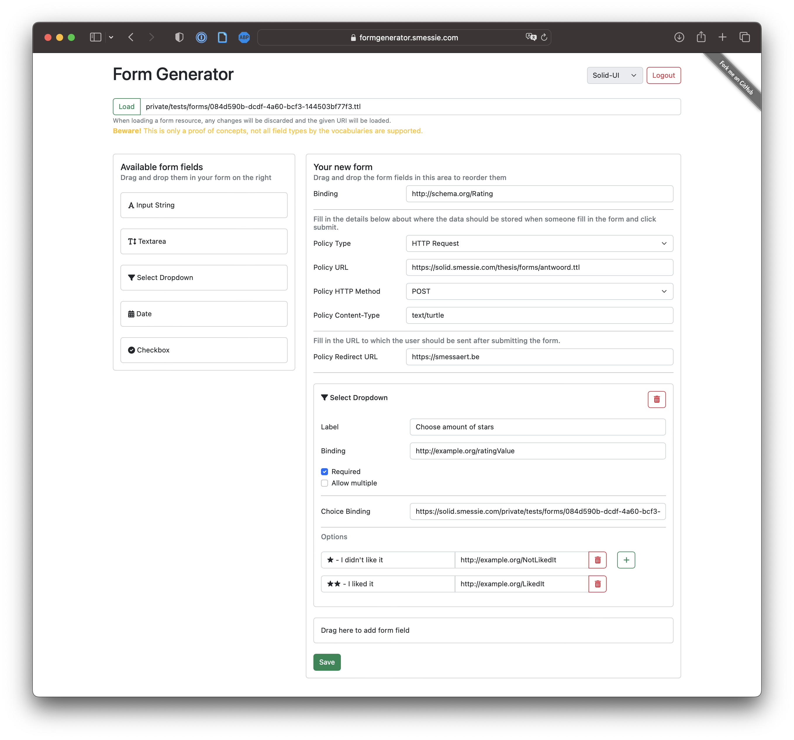

## Schema Alignment and Footprint Tasks
{:#reasoning}

Unfortunately, the move to decentralization and decoupling comes with its own challenges.
Two main challenges need to be tackled before this can be achieved.
First, decoupling also means that another app should be able to use or generate the form description.
The assumption can however not be made that all apps will use the same ontology to describe similar concepts.
To achieve a real decoupled solution, we need to be able to translate from one ontology to another.
Therefore, *schema alignment tasks* are introduced, functioning as a mapping to translate from one ontology to another ontology understood by the app.
This is implemented using reasoning by using [Notation3 (N3) rules](cite:cites n3) that define how to translate one piece of data to another.
These rules are collected in a *N3 conversion rules resource*.
This way, the form renderer can understand any vocabulary that is passed to it as long as there is a dictionary that maps it to the base vocabulary.

In addition to describing how the form should look, the form description should also declaratively describe what should happen in certain events such as submission.
Therefore, the form description is extended with *policies*.
The process of executing these policies is called the *footprint tasks* and is the second half of the reasoning part of the three-part view.
To describe policies, two languages are needed: a *rule language* and a *policy language* describing what actually should happen when a policy is executed.
As rule language, [N3](cite:cites n3) is used.
This is the same language that is used to describe the conversion rules in the schema alignment tasks and their N3 rules do exactly what is needed.
To describe the policy, a basic version of the [FnO ontology](cite:cites fno-paper) is used.

<figure id="fig:eaen-FormGenerator">

<figcaption markdown="block">
Screenshot of the implemented FormGenerator.
</figcaption>
</figure>

The *FormGenerator* app is implemented allowing one to declaratively define a form description by using drag-and-drop to build a form and letting them input the policy properties such as the redirect URL or the details for the HTTP request.
A screenshot of this FormGenerator app is shown in .
A to-do app is implemented providing a first use case for the schema alignment tasks and allowing a simple introduction to the concept.
This app also demonstrates the need for policies, as schema alignment tasks fall short in the event of a to-do status toggle.
If the app vocabulary should only insert a triple on the occurrence of an event, but the dataset vocabulary requires both an insert and a delete, schema alignment tasks cannot properly satisfy this requirement because according to the app vocabulary, there are no triples to delete, i.e., there are no triples to use in the rule premise.
This is also fixed by using policies, where the policy defines which triples should be inserted and deleted in case of a toggle to-do status event.
Finally, the form renderer apps are extended with these new schema alignment and footprint tasks.
